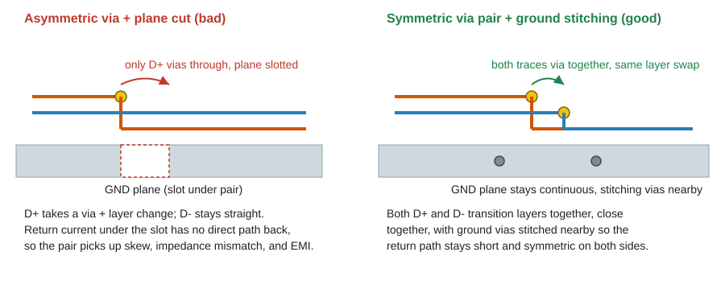
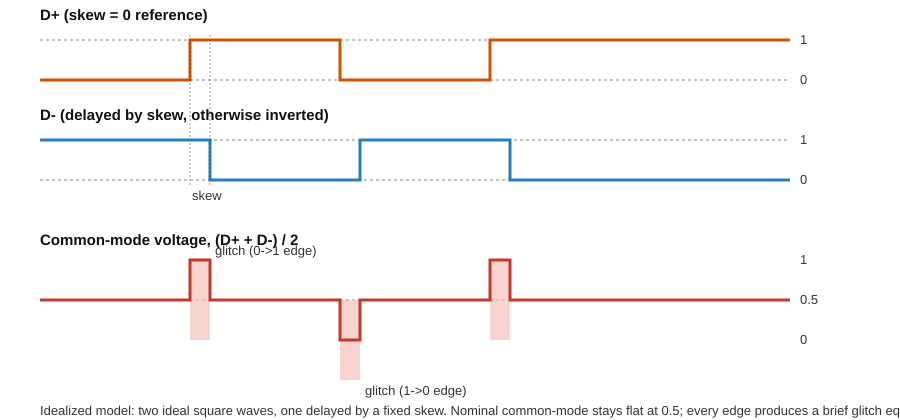
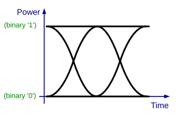
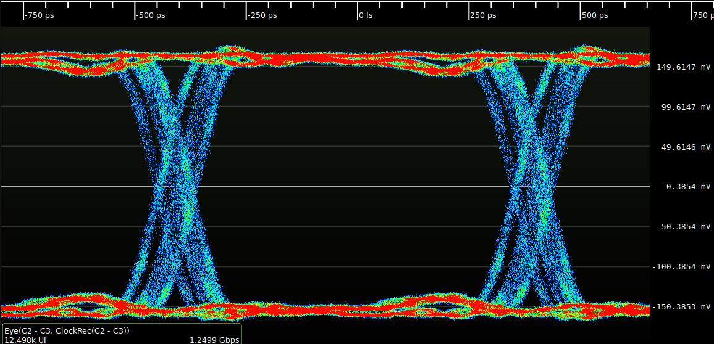

# Routing USB 2.0 Differential Pairs on a 4-Layer Board

I recently worked on a 4-layer IoT board that needed a USB 2.0 connection, and figured I'd write up how I approached routing the D+/D- differential pair. This isn't a textbook explanation, it's what I actually did, the numbers I used, and the mistakes I made sure not to repeat.

**What this covers:**
- Why a differential pair needs special treatment in the first place
- The stack-up and how it sets up everything else
- Calculating trace width/spacing for 90Ω differential impedance
- The schematic side (Type-C connector, decoupling, CC lines)
- The two routing rules that actually matter: length matching, and via placement
- Why those rules matter, shown visually (skew, common-mode noise, eye diagrams)
- The board as it came back from the fab

## Why differential pair routing matters for USB 2.0

USB 2.0 High-Speed signaling runs D+ and D- as a **differential pair** at 480 Mbps. The receiver doesn't really care what each line's voltage is relative to ground, it only cares about the difference between the two. That's what makes differential signaling so resistant to noise in the first place.

But that noise immunity only holds up if you treat the pair as a matched pair the whole way from driver to connector. Mismatched lengths, inconsistent spacing, a via sitting on only one of the two traces... any of these break the symmetry and you end up reintroducing common-mode noise. That shows up as EMI radiation, and at the receiver end, as jitter and a closed-up eye diagram (more on what that actually looks like further down).

So really, the whole job of "routing a diff pair" boils down to one thing: **keep both traces electrically identical to each other, start to finish.** Everything below is really just different angles on that one idea, starting with the stack-up, since that's what all the later numbers depend on.

## Stack-up

I went with a fairly standard 4-layer stack-up here, 1.6 mm overall thickness, standard FR4:

| Layer | Name | Type |
|---|---|---|
| 1 | Top | Signal |
| 2 | GND | Signal (solid ground plane) |
| 3 | PWR | Signal (power plane) |
| 4 | Bottom | Signal |

I routed the USB differential pair on the top layer, directly referenced to the solid GND plane on layer 2. That makes it a microstrip (edge-coupled, since D+ and D- sit side by side on the same layer). Having an unbroken ground plane right under the pair is really what gives you a controlled, predictable return path, and honestly that matters more for high-speed signals than almost anything else on the whole layout. Keep that in mind, it comes back later when we get to vias.

## Calculating the trace geometry for 90Ω differential impedance

With the stack-up fixed, the next question is what trace width and spacing actually gets you to spec. The USB 2.0 spec calls for a 90Ω differential impedance with ±15% tolerance. In practice though, most fabs and designers aim for a tighter ±10% window, just to leave some margin since manufacturing variance alone eats into that budget. Getting to 90Ω isn't something you guess at, it comes straight out of your stack-up (dielectric height and constant), and you solve for trace width and spacing using the edge-coupled microstrip equations.

I used JLCPCB's impedance calculator, plugging in the stack-up parameters straight from the fab's own material spec. The height (h) and dielectric constant (εr) need to match what the manufacturer actually builds, otherwise the whole calculation doesn't mean much.

Parameters I used:
- Trace type: Edge Coupled Microstrip
- Target differential impedance (Zd): 90 Ω
- Trace thickness (t): 1 oz/ft²
- Dielectric height (h): 0.11 mm
- Dielectric constant (εr): 4.29
- Trace spacing (s): 8 mil
- Solved trace width (w): 6.7033 mil

If you don't have access to a fab-specific calculator, [DigiKey's PCB Trace Impedance Calculator](https://www.digikey.com/en/resources/conversion-calculators/conversion-calculator-pcb-trace-impedance) is a decent general-purpose option for sanity-checking your numbers. Just make sure whatever tool you use lets you enter your actual copper weight, dielectric height, and εr instead of leaving it on default values.

## Schematic: Type-C connector and supporting components

Before getting into the actual routing, here's the schematic side, since the routing decisions later only make sense in context of what's actually connected.

A couple things worth pointing out here:
- CC1/CC2 get 5.1kΩ pull-down resistors (R21, R22). This is what tells a USB-C source "I'm a device that can sink current," and you need it even on a USB 2.0-only board with no PD support.
- VBUS decoupling uses a 10µF bulk cap plus a 100nF high-frequency cap, placed close to the connector on both the connector side and the downstream rail.
- D+ and D- come straight off pins 5/7 (DP1/DN1) toward the MCU/PHY with nothing else in the signal path. I didn't need series resistors here since the driving IC already handles internal source termination, but that's worth double checking against your own PHY's datasheet since a lot of discrete implementations still want 22Ω series resistors near the driver.

## Layout: the actual routing

This is the routed pair coming off the Type-C connector at the bottom of the board, heading up toward the GND-referenced via area near the top. If you'd rather hand this part off, JLCPCB also runs a [PCB layout](https://design.jlcpcb.com/?from=umer) service, you send over your schematic and requirements and their team routes the board for you. I routed this one myself though, and two rules drove basically every decision along the way.

### Rule 1: Length matching

D+ and D- need to reach the receiver within a tight length-matching tolerance. The exact number depends a bit on who you ask:

| Source guidance | Length-matching tolerance |
|---|---|
| USB 2.0 spec (general industry reading) | within roughly 150 mil (3.81 mm) |
| Common tighter design-house practice | under 0.5 mm (roughly 20 mil) |
| What I actually targeted on this board | under 5 to 7 mil in the tightest sections, well inside spec |

Any length difference between the two traces turns into skew, basically a timing offset between the two signals, and skew converts directly into common-mode noise because the receiver briefly sees an "unbalanced" signal every time the pair switches (there's a diagram showing exactly this a bit further down). USB 2.0's tolerance (around 150 mil) is actually pretty generous compared to something like USB 3.0, HDMI, or DisplayPort, so it forgives small mismatches. Still, I think it's worth routing as tight as your floorplan allows rather than routing right up to the edge of spec just because you can.

In practice this usually means adding small tuned serpentine (accordion) traces on whichever line ends up shorter, right after wherever the mismatch happens, like after a connector pin offset or a component you had to route around.

### Rule 2: Don't place vias in-line, and don't cut the pair apart

This was probably the rule I was most careful about on this layout. Keep D+/D- on the same layer, unbroken, and avoid vias on the pair unless there's genuinely no other way. There's more than one reason to care about this, and they kind of stack on top of each other:

1. **Impedance discontinuity.** A via has a completely different parasitic capacitance and inductance profile than a straight trace. Even a single via briefly pulls the local impedance away from your carefully calculated 90Ω, causing a reflection right at that spot. If you only put the via on one of the two traces (or place them slightly differently), you get asymmetric reflections, which is actually worse than a symmetric one because it directly creates common-mode noise instead of a small differential reflection.
2. **Return path discontinuity.** When a via moves the signal from the top layer to the bottom layer, the return current on the reference plane has to find a new route too, usually by hopping through a nearby ground via. If there isn't one close by, the return current ends up taking a longer, higher-inductance detour, and that shows up as extra EMI and added loop inductance right at that transition. This is exactly why the solid GND plane from the stack-up section matters so much.
3. **Broken plane or cut-through.** Routing a slot or cut in the reference plane directly under the pair (which happens fairly often when routing around connector shield tabs or mounting holes) removes the continuous return path the microstrip depends on. The pair can still look totally fine in 2D, but electrically it's now behaving like two separate transmission lines with a gap in between. Honestly this is one of the more common causes of USB signal integrity failures that don't show up until compliance testing.
4. **Length and skew mismatch from asymmetric via stubs.** Even when a via really is unavoidable, say, routing under a connector shell, if only one of the two traces takes it, or they use different via sizes or drill diameters, you end up adding extra length and extra parasitic delay to just one line. That brings back the exact skew problem from Rule 1.

The practical takeaway I'd give anyone is: route the pair fully on one layer from driver to connector wherever your floorplan allows it. And if you absolutely have to transition layers, do it with both traces together, using a symmetric via pair placed as close together as possible, with ground stitching vias nearby to give the return current somewhere to go.

## Seeing it in action: skew, common-mode noise, and eye diagrams

Both rules above come back to the same underlying mechanism, so it's worth actually seeing it rather than just taking it on faith.

### The skew to common-mode-glitch mechanism

I don't have access to a full field solver here, so rather than fake some numbers, I put together a simple idealized diagram that shows the actual mechanism at work. It models D+ and D- as two ideal square waves, one delayed slightly relative to the other (representing the length mismatch from Rule 1), and plots the resulting common-mode voltage, which is just the average of the two lines.

With zero skew, D+ and D- would be perfect inverses of each other at every instant, and the common-mode voltage would sit flat at the midpoint the whole time. Once you add skew, there's a short window after every transition where both lines are briefly at the same level. During that window the common-mode voltage jumps almost all the way to a full rail instead of staying at the midpoint. That's the glitch that radiates as EMI and shows up as noise at the receiver. The wider the skew, the wider that glitch window is, which is basically the whole reason length matching matters in the first place.

### Eye diagrams: how signal integrity actually gets judged

This is also a good place to bring in the eye diagram, which is the standard way signal integrity is actually judged on a real differential pair, including USB 2.0 compliance testing. Here's a generic textbook version of one, followed by a real measured example so you can see what an actual scope capture looks like:

*Generic on-off keying eye diagram by [Gmoose1](https://commons.wikimedia.org/wiki/File:On-off_keying_eye_diagram.svg), licensed [CC BY-SA 3.0](https://creativecommons.org/licenses/by-sa/3.0/).*

*Measured eye pattern of a 1000BASE-SX Ethernet data stream, digitized with a Teledyne LeCroy oscilloscope, by [Andrew D. Zonenberg](https://commons.wikimedia.org/wiki/File:Eye_pattern_2.png), licensed [CC BY 4.0](https://creativecommons.org/licenses/by/4.0/). This isn't a USB 2.0 capture specifically, it's included to show what a real measured eye looks like versus the idealized textbook version above.*

An eye diagram is built by overlaying thousands of unit intervals of a signal on top of each other. What you get is literally the shape of an eye: the more open that eye is (tall and wide), the cleaner the signal. Skew, impedance mismatch, and via-induced reflections all show up here as the eye closing in, either vertically (amplitude noise, which is what a skew-induced common-mode glitch adds) or horizontally (timing jitter). This is exactly why compliance test houses run eye diagram tests on USB 2.0 High-Speed signals: it's a single picture that captures the cumulative effect of everything discussed above, stack-up, impedance, length matching, and via placement, all at once.

### Going further: simulating your own board

If you want to go further than the idealized model above and actually simulate your own board (with real trace parasitics, dielectric loss, and coupling), here are tools people commonly use:
- [LTspice](https://www.analog.com/en/resources/design-tools-and-calculators/ltspice-simulator.html), free, good for time-domain circuit-level simulation once you've extracted approximate trace models
- [KiCad](https://www.kicad.org/) with its ngspice integration, useful if you're already laying the board out there
- [openEMS](https://www.openems.de/) with AppCSXCAD, a free, open-source 3D electromagnetic field solver if you want to model the actual copper geometry
- Commercial tools like Keysight ADS, Ansys HFSS, or Simbeor, which is what most professional signal integrity teams actually use for compliance-level work
- For inspiration on building a custom simulation from scratch, [this crosstalk analysis project](https://github.com/simostein/pcb-crosstalk-analysis) walks through writing your own quasi-TEM coupled-microstrip model in Python

## The manufactured board

All of the above is only worth as much as what actually comes back from the fab. Here's the board after manufacturing at JLCPCB, same design as the layout shown earlier. You can see the Type-C connector at the bottom and the routed traces underneath the solder mask, which is a nice way to close the loop between what got designed and what actually got built.

## Tools used

- Design, schematic, and layout: [EasyEDA](https://easyeda.com)
- Manufacturing and fabrication: [JLCPCB](https://jlcpcb.com/)
- Impedance calculation: JLCPCB's built-in stack-up and impedance calculator, cross-checked against [DigiKey's PCB Trace Impedance Calculator](https://www.digikey.com/en/resources/conversion-calculators/conversion-calculator-pcb-trace-impedance)

## Summary

Routing a USB 2.0 differential pair well isn't really about following a checklist blindly, it's about protecting one property from start to finish: D+ and D- need to stay electrically symmetric. A solid reference plane, a stack-up-matched impedance calculation, tight length matching, and avoiding asymmetric vias or plane cuts on the pair are what actually get you there in practice.

## References

- [Altium: Routing Requirements for a USB Interface on a 2-Layer PCB](https://resources.altium.com/p/routing-requirements-usb-20-2-layer-pcb)
- [JLCPCB Blog: USB 3.0 Differential Signaling, A Complete PCB Design Guide](https://jlcpcb.com/blog/usb3-differential-signaling-design-guide)
- [Cadence: USB Design Guidelines with OrCAD X](https://resources.pcb.cadence.com/blog/2025-usb-design-guidelines)
- [Cadence System Analysis: Differential Signal Return Paths and Ground Reference Planes](https://resources.system-analysis.cadence.com/blog/msa2021-differential-signal-return-paths-and-ground-reference-planes)
- [EDN: Return Path Discontinuities and EMI, Understand the Relationship](https://www.edn.com/return-path-discontinuities-and-emi-understand-the-relationship/)
- [PCBWay: Differential Pair Routing Guidelines for High-Speed PCB Design](https://www.pcbway.com/blog/PCB_Design_Layout/Differential_Pair_Routing_Guidelines_for_High_Speed_PCB_Design_43465b72.html)
- [Altium: What are Differential Pairs and Differential Signals?](https://resources.altium.com/p/what-are-differential-pairs-and-differential-signals)
- [DigiKey: PCB Trace Impedance Calculator](https://www.digikey.com/en/resources/conversion-calculators/conversion-calculator-pcb-trace-impedance)
